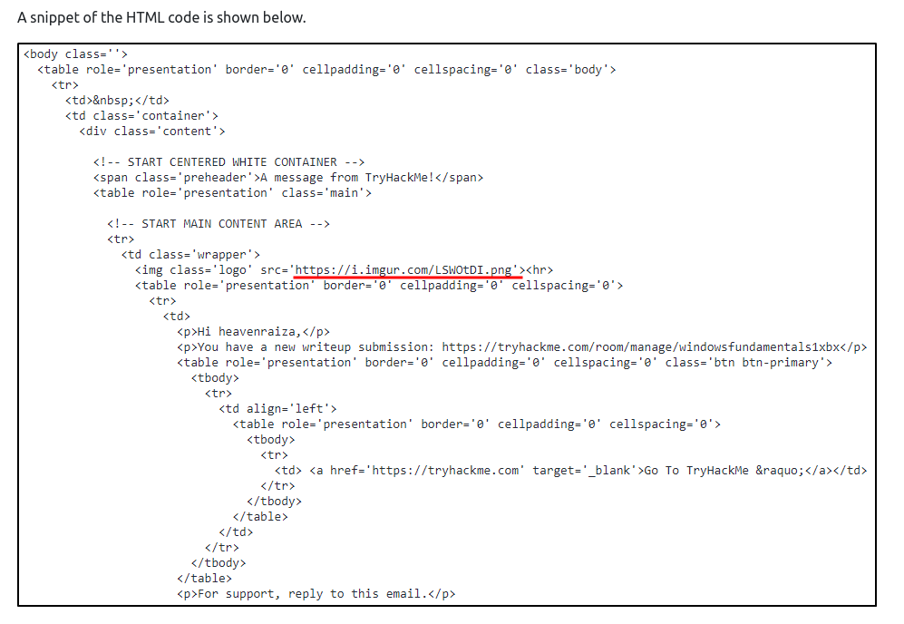
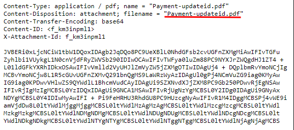
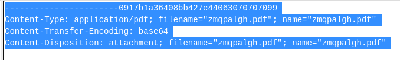
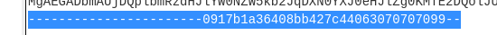
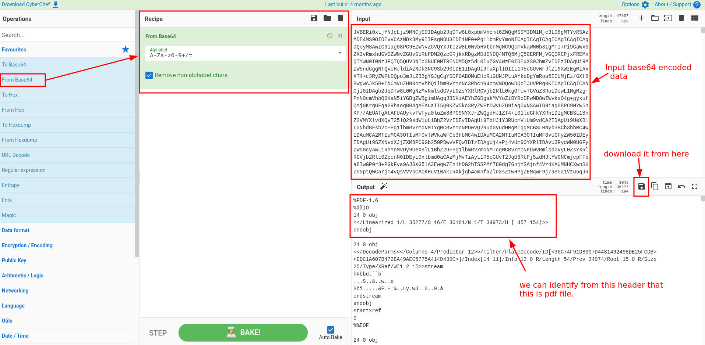
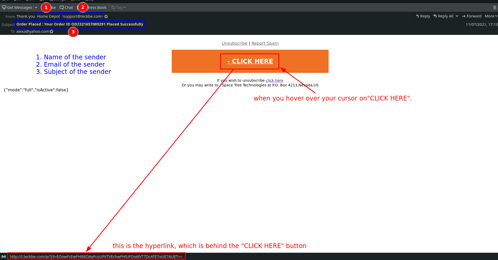
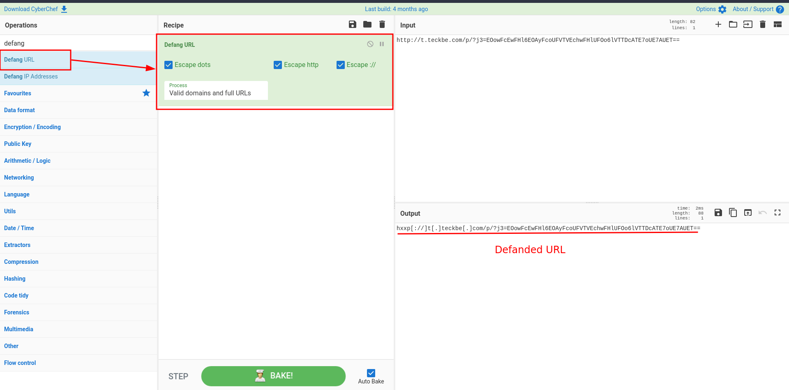

# Phishing Emails 1

The Room Link :- [Phishing Emails 1](https://tryhackme.com/room/phishingemails1tryoe)


## Table of Contents

- [Introduction](#Task-1---Introduction)
- [The Email Address](#Task-2---The-Email-Address)
- [Email Delivery](#Task-3---Email-Delivery)
- [Email Headers](#Task-4---Email-Headers)
- [Email Body](#Task-5---Email-Body)
- [Type of Phishing](#Task-6---Type-Of-Phishing)
- [Conclusion](#Task-7---Conclusion)

## Task 1 - Introduction

Spam and Phishing are common social engineering attacks. In social engineering, phishing attack vectors can be a phone call, a text message, or an email. As you should have already guessed, our focus is on email as the attack vector.

We all should be somewhat familiar with what spam is. No matter what, these emails somehow find their way into our inboxes.

The first email classified as spam dates back to [1978](https://www.britannica.com/topic/spam), and it's still thriving today in 2021.

Phishing is a serious attack vector that you, as a defender, will have to defend against.

An organization can follow all the recommended guidelines when it comes to building a layered defense strategy. Still, all it takes is an inexperienced and unsuspecting user within your corporate environment to click on a link or download and run a malicious attachment which may provide an attacker a foothold into the network.

Many products help combat spam and phishing, but realistically these emails still can get through. When they do, as a Security Analyst, you need to know how to analyze these emails to determine if they're malicious or benign.

Furthermore, you will need to gather information about the email to update your security products to prevent malicious emails from making their way back into a user's inbox.

In this room, we'll look at all the components involved with sending emails across the Internet and how to analyze email headers.

### Answer The Questions Below

- Read the above and launch the attached VM.

```markdown
No Answer Needed
```

## Task 2 - The Email Address

The invention of the email dates back to the **1970s** for ARPANET. Yep, probably before you were born. Definitely, before I was born. :)

### Answer The Questions Below

Email dates back to what time frame?

```markdown
1970s
```

## Task 3 - Email Delivery

The port numbers you set determine the protocol (IMAP or POP) your email client uses. There are four basic options.

**IMAP secure** is the recommended *configuration:*

- IMAP (secure) — RECOMMENDED
- IMAP (insecure)
- POP3 (secure)
- POP3 (insecure)

1. **What is IMAP?**

- IMAP syncs your mail client program with the server. Emails stay on the server, and you can make and view mail folders on the server in addition to the Inbox. Most mail client program have a feature to initially sync just the email headers, so you can quickly see what emails you have, then download the message body when you want to read the email. Since emails stay on the server, you can see all your emails from any mail client program or device. Webmail uses IMAP.

2. **What is POP3?**

- POP3 downloads all mail from the server from the Inbox and stores it on your computer. This way, emails are available when you're not connected to the Internet.you also have the option (in your mail client) to keep email on the server. If you choose not to enable this setting in your mail client, the emails are removed from the server and only stored locally in your mail client program.

3. **What is SMTP?**

- SMTP is used to send and receive email. It is sometimes paired with IMAP or POP3 (for example, by a user-level application), which handles the retrieval of messages, while SMTP primarily sends messages to a server for forwarding. SMTP can both send and receive mail, but it's bad at queuing incoming messages, hence the common delegation to other protocols. Proprietary systems like Gmail have their own mail transfer protocols when using their own servers, but they still use good old SMTP to email beyond that.

#### **Recommended — Incoming IMAP secure**

- IMAP | Port 993 (Secure Transport — SSL function enabled)

#### **Other options**

- POP3 | Port 995 (Secure Transport   — SSL function enabled)
- IMAP | Port 143 (Insecure Transport — No SSL function enabled)
- POP3 | Port 110 (Insecure Transport — No SSL function enabled)

#### **Recommended — Outgoing IMAP secure**

- SMTP | Port 465 (Secure Transport — SSL function enabled)
- SMTP | Port 587 (Insecure Transport, but can be upgraded to a secure connection using
  STARTTLS)

#### **Not Recommended**

- SMTP | Port 25 (Outdated and not recommended. username/password authentication MUST be enabled if using this port.)

### Answer The Questions Below

What port is classified as Secure Transport for SMTP?

```markdown
465
```

What port is classified as Secure Transport for IMAP?

```markdown
993
```

What port is classified as Secure Transport for POP3?

```markdown
995
```

## Task 4 - Email Headers

Now in this section we need to look at the given `.eml` and `.txt` files which is there in the *TryHackMe Machine* and also we have it in our repository inside the `room-files` folder.

so open up those file and read along

**CAUTION:** It is important to know that when reading an email header every line can be forged, so only the **Received:** lines that are created by your service or computer should be completely trusted.

**From:** This displays who the message is from, however, this can be easily forged and can be the least reliable.

**Subject:** This is what the sender placed as a topic of the email content.

**Date:** This shows the date and time the email message was composed.

**To:** This shows to whom the message was addressed, but may not contain the recipient's address.

**Return-Path:** The email address for return mail. This is the same as "*Reply-To:*".

**Envelope-From/To:**  The envelope to/from information is the real information that is used for message delivery, for both email servers and post offices.

**Delivery Date:** This shows the date and time at which the email was received by your (mt) service or email client.

**Received:** The received is the most important part of the email header and is usually the most reliable. They form a list of all the servers/computers through which the message traveled in order to reach you.

The received lines are best read from bottom to top. That is, the first "Received:" line is your own system or mail server. The last "Received:" line is where the mail originated. Each mail system has their own style of "Received:" line. A "Received:" line typically identifies the machine that received the mail and the machine from which the mail was received.

**DKIM-Signature & Domainkey-Signature:** DomainKeys (informally DK) is a deprecated e-mail authentication system designed by Yahoo to verify the domain name of an e-mail sender and the message integrity.

Aspects of DomainKeys, along with parts of Identified Internet Mail, were combined to create DomainKeys Identified Mail, which is now widely used.

Both DomainKeys and DKIM were published in May 2007, DomainKeys as an "historical" protocol, and DKIM as its standards-track replacement.

**Message-id:** A unique string assigned by the mail system when the message is first created. These can easily be forged.

**Mime-Version:** Multipurpose Internet Mail Extensions (MIME) is an Internet standard that extends the format of email. Please see [http://en.wikipedia.org/wiki/MIME](http://en.wikipedia.org/wiki/MIME) for more details.

**Content-Type:** Generally, this will tell you the format of the message, such as html or plaintext.

**X-Spam-Status:** Displays a spam score created by your service or mail client.

**X-Spam-Level:** Displays a spam score usually created by your service or mail client.

**Message Body:** This is the actual content of the email itself, written by the sender.

**Finding the Original Sender:** The easiest way for finding the original sender is by looking for the *X-Originating-IP* header. This header is *important* since it tells you the *IP address* of the computer that had sent the email. If you cannot find the *X-Originating-IP* header, then you will have to sift through the Received headers to find the sender's IP address.

Once the email sender's *IP address* is found, you can search for it at [http://www.arin.net/](http://www.arin.net/). You should now be given results letting you know to which ISP (Internet Service Provider) or webhost the *IP address* belongs. Now, if you are tracking a spam email, you can send a complaint to the owner of the originating IP address. Be sure to include all the headers of the email when filing a complaint.

### Answer The Questions Below

What email header is the same as "Reply-to"?

```markdown
Return-Path
```

Once you find the email sender's IP address, where can you retrieve more information about the IP?

```markdown
http://www.arin.net
```

## Task 5 - Email Body

The email body is the part of the email which contains the text (plain or HTML formatted) the sender wants you to view. 

HTML is what makes it possible to add these elements to an email.

The email can contain an image and embedded hyperlinks.

You can view and block the images & embedded hyperlinks in webmail clients by looking at its settings. 

as We can see it in below image 



Lastly, emails may contain attachments. The same premise applies; you can view an email's attachment from an email's HTML format or by viewing the source code. 

The following example is an HTML formatted email from "Netflix" with an attachment. 

The email attachment is a PDF document.



We have already given one attechment on the TryHackMe machine called `email2.txt` for analysis so let's analyze it.

so Let's first open up the [CyberChef - The Cyber Swiss Army Knife](https://gchq.github.io/CyberChef/)

and input the contents of the `email2.txt` after removing the header and futter 




and apply the Recipe "From Base64" to decode the pdf file and then download it 



#### If You Want to Do It With Terminal

Step: 1 - first remove the file header and and futter as shown in above images using your favorite command line text editor, for me it did it with `vim`.
```bash
~$ vim email2.txt 
```
Step: 2 - decode it with bewlow command pipe it in `output.pdf` file.
```bash
~$ cat email2.txt | base64 -d > output.pdf
```
Step: 3 - Open it with `xdg-open`.
```bash
xdg-open output.pdf
```
### Answer The Questions Below

In the above screenshots, what is the URI of the blocked image?
```markdown
https://i.imgur.com/LSWOtDI.png
```

In the above screenshots, what is the name of the PDF attachment?
```markdown
Payment-updateid.pdf
```
In the attached virtual machine, view the information in email2.txt and reconstruct the PDF using the base64 data. What is the text within the PDF?
```markdown
THM{this-is-demo-flag}
```

## Task 6 - Types Of Phishing

Now the best way to analyze the `.eml` file is to open it in any offline email client.

For me I have opend it in `thunderbird` and I got this



From the picture I can quicky find the sender Name, Email, Subject etc. information and can easily see the hyperlinks by hover over my cursor there and copy it by right clicking and select `Copy Link Location`.

NOTE :- We can see this information by open it in any text editor but we need to decode some information from base64 but any email client does it by default and directly shows the output . which is easier to analyze `.eml` file but for more detailed information we have to look at raw `.eml` file.  

### Email Security – Defanging URLs

When sending the contents of an artifact within an email notification, any web and IP addresses are automatically “defanged” to prevent the user from inadvertently clicking a malicious link.

The following occurs when URLs are defanged:
- “`http`” is replaced with “`hxxp`”
- “`ftp`” is replaced with “`fxp`”
- Brackets are added to domain names; for example, `www.example.com` is replaced with `www[.]example[.]com`
- Brackets are added to the IP address; for example, `8.8.8.8` is replaced with `8[.]8[.]8[.]8`

We can defang URL with [CyberChef - The Cyber Swiss Army Knife](https://gchq.github.io/CyberChef/)



### Answer The Questions Below

What trusted entity is this email masquerading as?
```markdown
Home Depot
```

What is the sender's email?
```markdown
support@teckbe.com
```

What is the subject line?
```markdown
Order Placed : Your Order ID OD2321657089291 Placed Successfully
```

What is the URL link for - CLICK HERE? (Enter the defanged URL)
```markdown
hxxp[://]t[.]teckbe[.]com/p/?j3=EOowFcEwFHl6EOAyFcoUFV=TVEchwFHlUFOo6lVTTDcATE7oUE7AUET==
```

## Task 7 - Conclusion

Before ending this room, you should know what [BEC](https://www.proofpoint.com/us/threat-reference/business-email-compromise) (Business Email Compromise) means.

A BEC is when an adversary gains control of an internal employee's account and then uses the compromised email account to convince other internal employees to perform unauthorized or fraudulent actions. 

Tip: You should be familiar with this term. I have heard this question asked before in a job interview. 

Within this room, we covered the following:
What makes up an email address?
How an email travels from sender to recipient.
How to view the source code of an email header.
How to view the source code of an email body. 
Understand the pertinent information we should obtain from an email we're analyzing.
Some common techniques attackers use in spam and phishing email campaigns.
In the upcoming Phishing Analysis series, we'll look at samples of various common techniques used in phishing email campaigns, along with tools to assist us with analyzing an email header and email body. 

### Answer The Questions Below


What is BEC?
```markdown
Business Email Compromise
```

Room Completed!

Hopefully you enjoyed as much as I did :-)