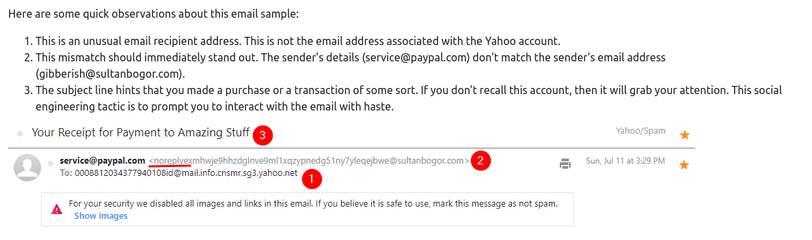
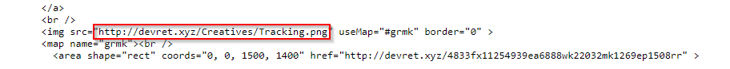
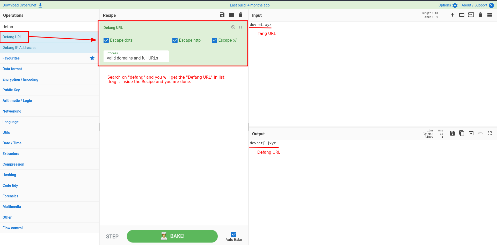
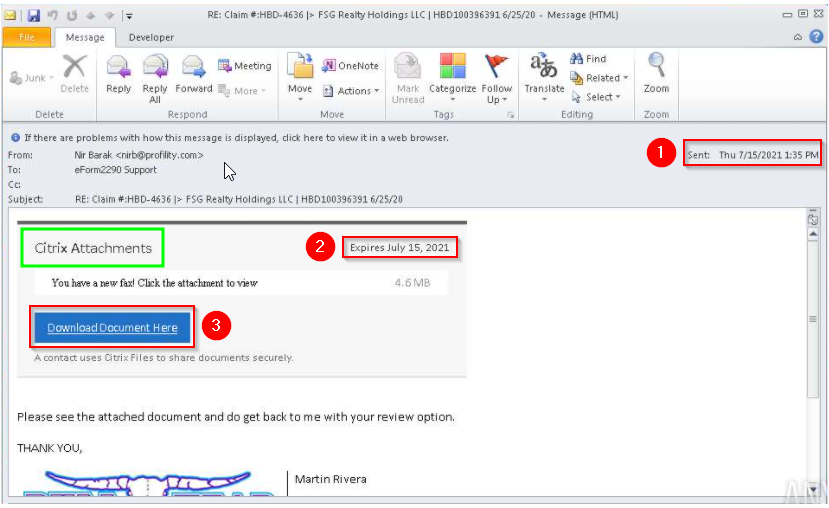
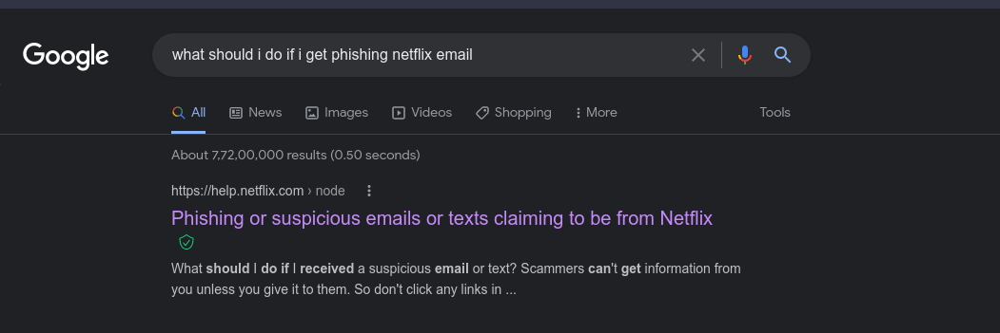
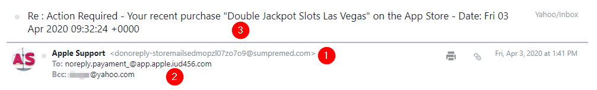
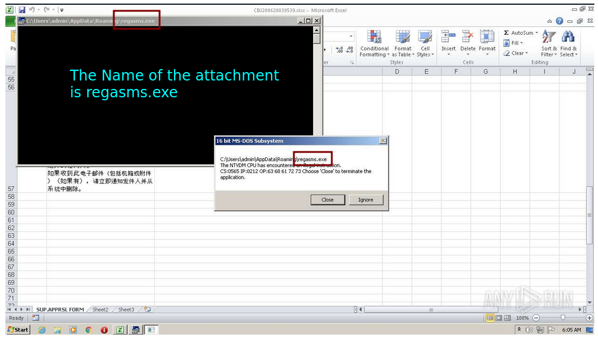

# Phishing Emails 2

The Room Link :- [Phishing Emails 2](https://tryhackme.com/room/phishingemails2rytmuv)


## Table of Contents

- [Introduction](#Task-1---Introduction)
- [Cancel Your Paypal Order](#Task-2---Cancel-Your-Paypal-Order)
- [Track Your Package](#Task-3---Track-Your-Package)
- [Select Your Email Provider To View Document](#Task-4---Select-Your-Email-Provider-To-View-Document)
- [Please-Update-Your-Payment-Details](#Task-5---Please-Update-Your-Payment-Details)
- [Your-Recent-Purchase](#Task-6---Your-Recent-Purchase)
- [DHL Express Courier Shipping Notice](#Task-7---DHL-Express-Courier-Shipping-Notice)
- [Conclusion](#Task-8---Conclusion)

## Task 1 - Introduction

Now that we covered the basics concerning emails in [Phishing Emails 1](../Phishing-Emails-1/README.md), let's dive right into actual phishing email samples. 

Each email sample showcased in this room will demonstrate different tactics used to make the phishing emails look legitimate. The more convincing the phishing email appears, the higher the chances the recipient will click on a malicious link, download and execute the malicious file, or even send the prince of some country a wire transfer. 

Warning: The samples throughout this room contain information from actual spam and/or phishing emails. Proceed with caution if you attempt to interact with any IP, domain, attachment, etc.

### Answer the question below

Read the above.
```markdown 
No answer needed
```
## Task 2 - Cancel Your Paypal Order



### Answer the questions below

What phrase does the gibberish sender email start with?
```markdown
noreply
```

## Task 3 - Track Your Package

We can see root domain in this below picture.



To defang the root domain open up [CyberChef](https://gchq.github.io/CyberChef/)



### Answer the questions below

What is the root domain for each URL? Defang the URL. 
```markdown
devret[.]xyz
```

## Task 4 - Select Your Email Provider To View Document



Citrix Systems, Inc. is an American multinational cloud computing and virtualization technology company that provides server, application and desktop virtualization, networking, software as a service, and cloud computing technologies.

### Answer the questions below

This email sample used the names of a few major companies, their products, and logos such as OneDrive and Adobe. What other company name was used in this phishing email?
```markdown
citrix
```

## Task 5 - Please Update Your Payment Details

To complete this task I did a quick google search "what should i do if i get phishing netflix email" and I got this link from <help.netflix.com>.



The first result is [This page of Netflix](https://help.netflix.com/en/node/65674).

Users who receive a suspicious email or text message claiming to be from Netflix are advised to `forward the message to phishing@netflix.com` for further review by the company.

### Answer the questions below

What should users do if they receive a suspicious email or text message claiming to be from Netflix?
```markdown
forward the message to phishing@netflix.com 
```

## Task 6 - Your Recent Purchase

This email sample will highlight the following techniques:

- Spoofed email address
- Recipient is BCCed
- **Urgency**
- Poor grammar and/or typos
- Attachments

Here are some quick observations about this email sample:

1. This email is made to appear that it's from Apple Support, but the sender's address is gibberish@sumpremed.com. 
2. This email wasn't sent directly to the victim's inbox but rather BCCed ([**Blind Carbon Copy**](https://www.technology.pitt.edu/help-desk/how-to-documents/using-blind-carbon-copy-bcc-feature-protect-privacy-email-addresses)). The recipient email looks like another spoofed email to appear as a legitimate Apple email address. 
3. Here is the element of urgency. Action is required on behalf of the victim. 



There are a few noticeable typos in both the sender and recipient email addresses: donoreply and payament.

This particular email doesn't necessarily have an email body. It's totally blank. The email simply contains an attachment. 

### Answer the questions below


What does BCC mean?
```markdown
blind carbon copy
```

What technique was used to persuade the victim to not ignore the email and act swiftly?
```markdown
urgency
```
## Task 7 - DHL Express Courier Shipping Notice

This email sample will highlight the following techniques:

- Spoofed email address
- HTML to impersonate a legitimate brand
- **Attachments**

The attachment runs a payload that throws an error. 



### Answer the questions below

What is the name of the executable that the Excel attachment attempts to run?
```markdown
regasms.exe
```
## Task 8 - Conclusion

In this room, we looked at various phishing samples. 

Some of the samples shared similar techniques whereas, others introduced a new tactic for you to see and learn from. 

Understanding how to detect phishing emails takes awareness training.

Visit the resources below to acquaint yourself with other signs to look out for in phishing emails. 

**Additional Resources:**

- <https://www.knowbe4.com/phishing>
- <https://www.itgovernance.co.uk/blog/5-ways-to-detect-a-phishing-email>
- <https://cheapsslsecurity.com/blog/10-phishing-email-examples-you-need-to-see/>
- <https://phishingquiz.withgoogle.com>

The next room in this module: [Phishing Emails 3](https://github.com/0xr001/TryHackMe-Walkthrough/tree/master/Phishing-Emails-3)

### Answer the questions below

Read the above.
```markdown
No answer needed
```

Room Completed!

Hopefully you enjoyed as much as I did :-)